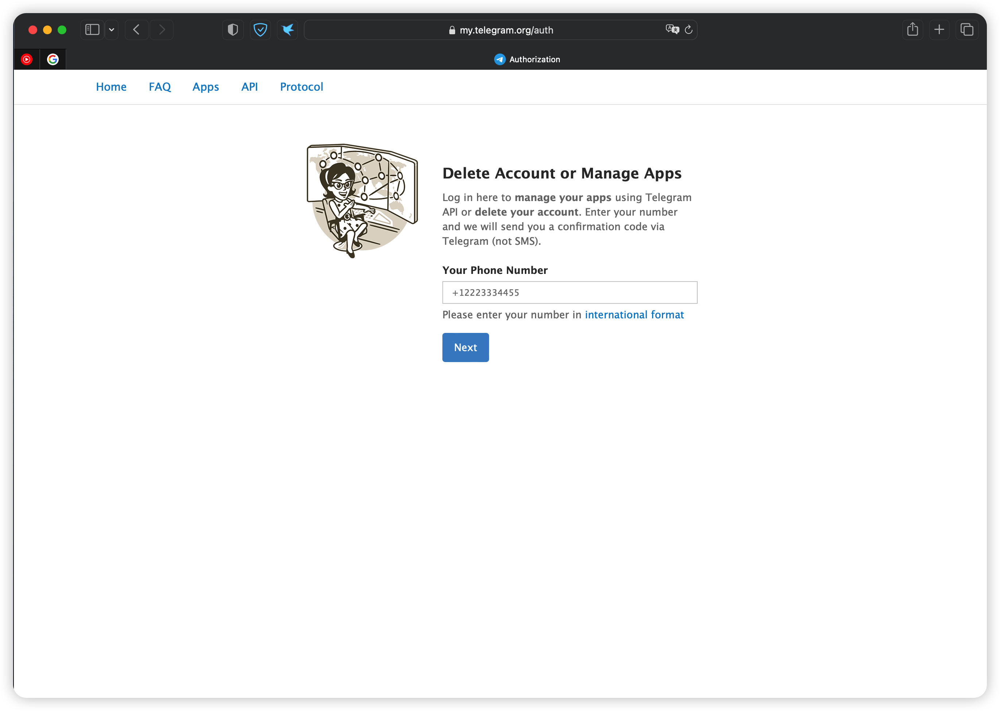
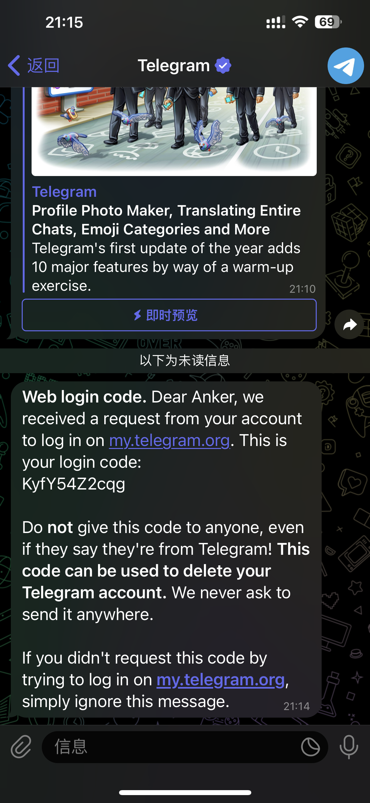
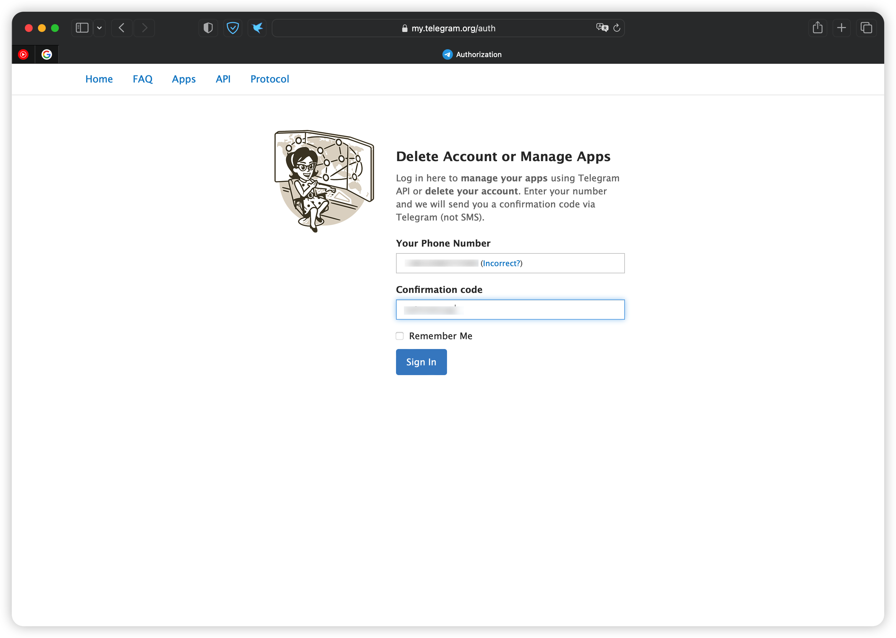
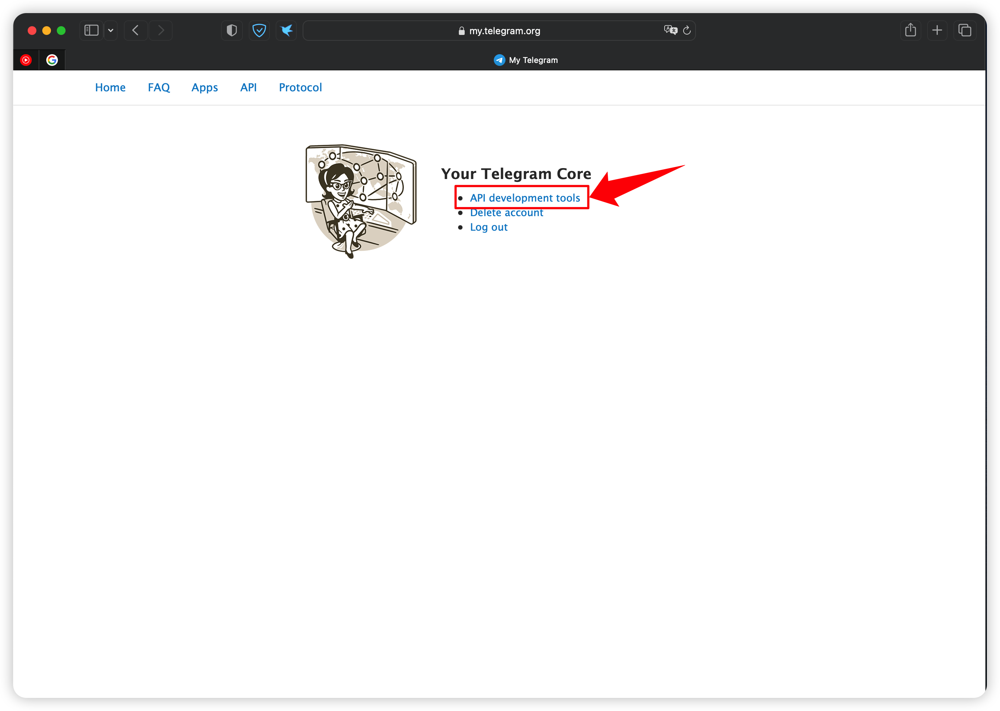
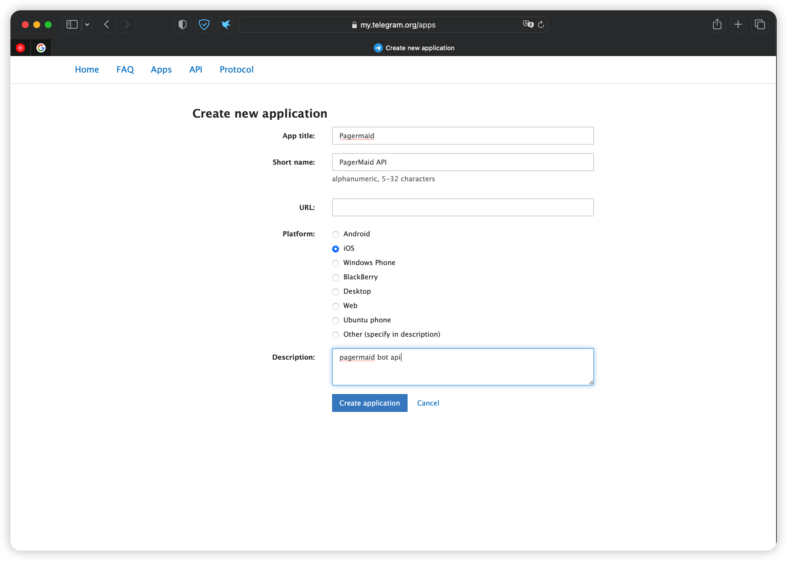
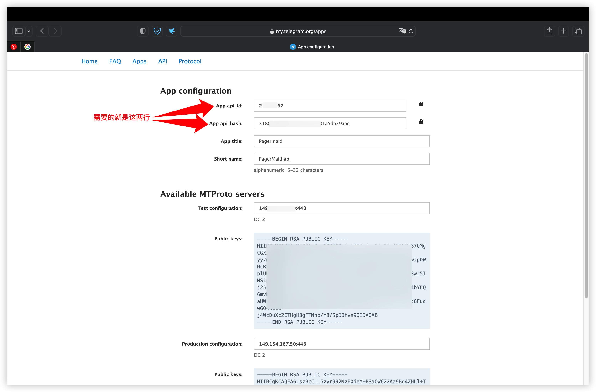

# Telegram从玩bot到被销号

## 写在前面
本教程基于 Ubuntu 22.04 系统，搭建 Pagermaid-Pyro ，其他系统请自行修改命令安装。理论上支持 AMD64 和 ARM 架构。

GitHub 开源地址：https://github.com/TeamPGM/PagerMaid-Pyro

GitLab 开源地址：https://gitlab.com/Xtao-Labs/PagerMaid-Pyro

官方网站：https://xtaolabs.com/

官方 Telegram 频道：@PagerMaid_Modify


本文主要介绍从注册Telegram（下面简称tg）API到在自己的VPS上建立Pagermaid-Pyro Bot来实现一些有趣的功能。
Pagermaid 简介
PagerMaid 是一个开源的 Telegram 人形自走 Bot 方案，基于 Python 开发，功能强大而丰富，它通过响应账号通过其他客户端发出的命令来自动执行一系列任务，可以帮助你打造专属的便利功能。

**隐私政策与免责声明
您在使用本项目代码时即表示您已经同意本隐私协议并且允许我们以评估负载和修复代码的目的记录您 Bot 的在线状态和报错文件。
除可能使用的信息之外，我们不会记录与收集任何信息。
本项目代码完全遵循此隐私政策，您可以随时在此项目中审查我们的源代码。
本项目无法承诺 Userbot 行为不会被 Telegram 官方滥权，也无法承诺所有功能能在自建项目上成功运行。
使用 Userbot 所带来的损失或可能产生的任何责任由搭建者自行承担。**


## 一，注册Telegram的API

**申请 API 属于高危操作，特别是新注册的 Telegram 账号和使用 VoIP 语音号码注册的账号会加大封号概率，如被封号，请尽快向客服申诉申请解封。同时请勿将 API 泄露给他人。**

在进行安装bot之前，首先需要到Telegram的官方API网站：[https://my.telegram.org/auth](https://my.telegram.org/auth) 按照页面提示，输入自己telegram
绑定的手机号码，记得号码要加上国家区号，例如中国号码+86，美国+1

输入正确的手机号码之后，点击NEXT，这时候已经登陆的telegram
会收到发来的信息，如下图所示，login code后面那单独的一小行即为登陆验证码。

将验证码输入到Confirmation code，点击Sign in即可登陆。

正确的登陆进去之后会有几个选项，这里选择API development tools，**不要选Delete account哦，这是删除你帐号的**。

选择API 开发工具后，进入如下的页面，你们可以按照我这个例子来填写即可，我没填的地方都是可以空着的。填写好后，点击底下的Creat application

如果没什么问题的话就会生成api了，而本次也只需要用到App api_id和App api_hash这两项，其余的都不用管它。将这两项里面的内容分别复制出来留着后面备用。

这里说一点小Tips：
1，可能有人在登陆第一步的时候会收不到验证码，因为tg发验证码是随机往绑定的手机上发sms或者往tg里面发信息，如果没收到可以等一会儿再试试；

2，如果你所用的是机场的线路，可能IP不太干净，这时候可能会一直收不到验证码，包括后面创建api也会提示出错，这里比较建议使用warp通过代理链的方式来进行。
不知道什么是warp？来看看这篇教程：[Zero Trust 从入门到放弃](https://github.com/getsomecat/GetSomeCats/blob/Surge/Zero%20Trust%20从入门到放弃.md)

## 二，在VPS上搭建pagermaid-pyro bot
在上面已经申请好API后，就可以根据[官方文档](https://xtaolabs.com/#/install_dependencies)进行Bot的安装了。
本文以我东京甲骨文4+24的ARM为例，系统是Ubuntu 22.04，其它版本请根据情况结合官方文档进行。
按照本教程的步骤会将 Pagermaid-Pyro 安装至 /var/lib/pgp 目录下。
同时也可以在不同目录同时搭建以实现一机多账号，例如：
/var/lib/pgp1, /var/lib/pgp2, …
如果需要一机多帐号，请注意后面安装的目录和相应的服务进行修改。

### 配置环境：
#### 开放端口
由于需要与 Telegram 服务器通信，首先开放服务器端口。

```

sudo iptables -P INPUT ACCEPT

sudo iptables -P FORWARD ACCEPT

sudo iptables -P OUTPUT ACCEPT

sudo iptables -F


```

#### 为 PagerMaid 创建用户
为了您的操作不当而造成不可预期的后果，应避免应用直接运行在 root 用户，此处我们为 PagerMaid 创建用户。（如果你跟我一样是喜欢root下一把梭的可以跳过此段）

1，创建用户

创建 pagermaid 用户，并为其创建目录：

```

sudo useradd -m pagermaid

```

2，设置密码（可选）

如果您有需求为用户设置密码，只需执行 `sudo passwd pagermaid` 即可。

3，为用户提供 sudo 权限（可选）

* 如果您有需求让 PagerMaid 执行需要 root 权限的操作，则需进行以下操作：

提供 sudo 权限

```

sudo usermod -a -G sudo pagermaid

```

* 使 pagermaid 用户无需密码认证使用 sudo

在执行` visudo` 后，在末尾追加以下内容：

```

pagermaid ALL=(ALL) NOPASSWD:ALL

```

4，设置默认 Shell（可选）

默认情况下，创建用户后，用户的默认 Shell 为 sh，对用户的操作十分不便。

通常情况下，我们选用 bash 作为我们的默认 Shell，当然，您也可以选用诸如 zsh 的 Shell。

如果您有需求修改默认 Shell，则需进行以下操作：

```

sudo chsh -s /bin/bash pagermaid

```

（如果您不使用 bash，可以修改 /bin/bash 为你所需设置的 Shell 的路径）

5，进入用户进行接下来的操作
```

sudo su pagermaid       # 进入 pagermaid 用户
cd ~                    # 进入 pagermaid 用户家目录

```

### 安装并配置 PagerMaid

#### 拉取项目
```

git clone https://github.com/TeamPGM/PagerMaid-Pyro.git pagermaid

```
#### 安装依赖包
```

pip3 install -r requirements.txt

```

#### 修改配置文件
将配置 config.gen.yml 文件复制一份并且命名为 config.yml
```

cp config.gen.yml config.yml        # 复制模板
vi config.yml                       # 修改文件

```

#### 设置 API（可选）
在最新版本的 Pagermaid-Pyro 中添加了默认的 api_id 和 api_hash ，故生成 API 与填写相关配置项为可选操作。（公开的 API Key 可能会受到限制，导致无法登录，此时仍需自行申请 API）
在 Telegram 开发者面板 生成 API 信息，将 App api_id 和 App api_hash 分别填入 api_key 和 api_hash （编辑时请注意不要删掉引号）

#### 代理配置（可选）

此步是将安装插件的获取源文件更改为国内可以访问的反代源，但是可能因为 cdn 原因，插件更新不及时。

```

git_source: "https://gitlab.com/Xtao-Labs/PagerMaid_Plugins/-/raw/master/"

```
#### 二维码登录（用于无法接收到验证码）（可选）

此步是将登录方式切换到手机扫码登录，解决无法收到验证码的问题，手机扫码途径：运行 APP - 设置 - 设备 - 扫码登录新客户端。

```

qrcode_login: "True"

```
#### 登录账号
```

python3 -m pagermaid

```
填入完整的电话号码（如：+12569986522），随即 Telegram 将会向你的其他客户端发送验证码，填入验证码即可。如有两步验证密码，则再输入两步验证密码即可。

**完成以上步骤后，按下 Ctrl + C 终止应用。**

请注意保护好您已登录的 pagermaid.session 。此文件可以进行账号所有操作，请不要分享给他人使用。

#### 进程守护
此步骤可以方便 PagerMaid 的自动运行，您无需在 PagerMaid 意外退出或主机重启后重新登录主机进行操作。

```

sudo cat <<'TEXT' > /etc/systemd/system/pagermaid.service
[Unit]
Description=PagerMaid-Pyro Telegram Utility Daemon
After=network.target

[Install]
WantedBy=multi-user.target

[Service]
Type=simple
User=pagermaid
Group=pagermaid
WorkingDirectory=/home/pagermaid/pagermaid
ExecStart=/usr/bin/python3 -m pagermaid
Restart=always
TEXT

```

#### 常用指令
Vi编辑器的操作：按"i"底下会出现INSERT提示，然后就可以进行编辑了，编辑完成后按"ESC"后再按":wq"保存退出

所有用vi进行编辑操作的都可以用nano进行，nano的底下就有快捷键提示：
保存退出：control+X

启动程序：`sudo systemctl start pagermaid`

设置为开机自启：`sudo systemctl enable pagermaid`

停止程序：`sudo systemctl stop pagermaid`

写在最后的一点提醒：**滥用bot可能导致你的telegram帐号被删除，请谨慎使用。**

怂别用，用别怂。
 
 本文有部份内容来源于：https://owo.cab/32/ 对作者表示感谢，如果有异议可以联系我删除。
