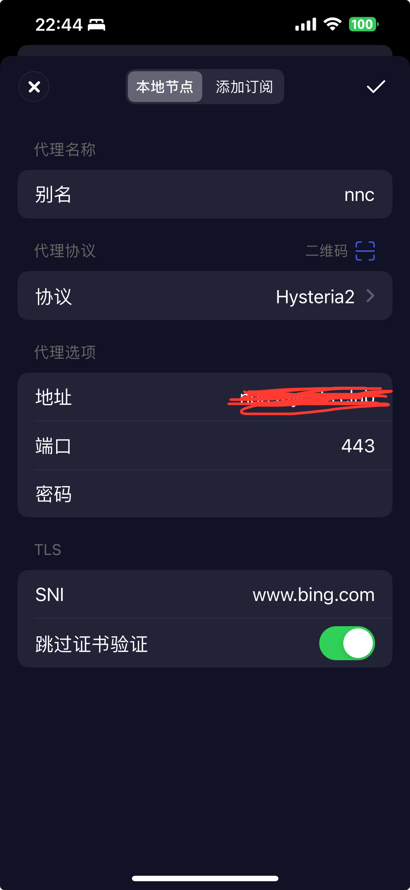
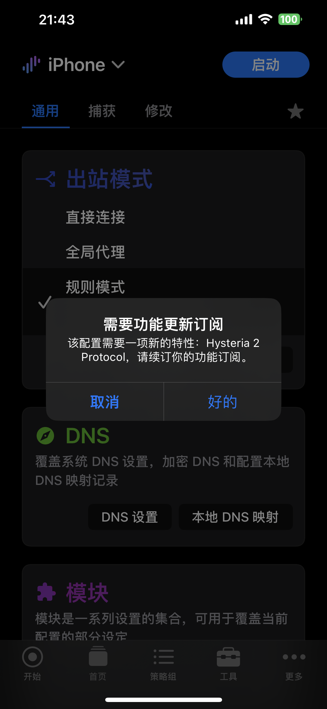

# 手动搭建 Hysteria2 协议用于Surge/Loon

沉寂了很久的老刘，在今天surge的TF版Surge 5 5.21.0 (2875)给大家带来了最新的订阅项目Hysteria2协议的支持。
2023年10月29日更新：Loon在TF版3.1.3（629）中也增加了对hysteria2协议的支持。

## 关于

Hysteria是底层传输基于udp的加密代理协议，对比目前使用的ss、vmess、vless、trojan等协议，Hysteria在绕过防火墙审查的同时还能大幅提升上网速度，这是因为Hysteria修改了quic的拥塞控制算法。最近Hysteria2更新到了2.0版本，大幅提升了性能和稳定性，支持反代伪装，增加抗审查能力。

## 需要准备的（acme方式）

- 一台VPS（支持UDP）
- 一个域名
- 将域名解析到VPS的IP

### 后文有没有域名自签证书的方式（注意ACME和自签证书二选一）

## 开始

安装服务端

官方已经准备好了一键

`bash <(curl -fsSL https://get.hy2.sh/)`

安装好后如下图：


如果英语水平不是那么差的话应该能够读懂

接下来先配置服务端

根据你的喜好使用vim或者nano 修改 `/etc/hysteria/config.yaml`文件

```
# listen: :443

acme:
  domains:
    - www.yourdomain.com      //你的域名
  email: your@email.com       //你的邮箱

auth:
  type: password
  password: yourpassword      //你的密码

masquerade:
  type: proxy
  proxy:
    url: https://www.bing.com/    //想伪装的sni
    rewriteHost: true
quic:
  initStreamReceiveWindow: 26843545 
  maxStreamReceiveWindow: 26843545 
  initConnReceiveWindow: 67108864 
  maxConnReceiveWindow: 67108864 
```

或者也可以直接对下面的代码进行修改后复制进去使用：

```
cat << EOF > /etc/hysteria/config.yaml
listen: :443

acme:
  domains:
    - xxx.com #把xxx.com改成你的域名，需要先解析到服务器ip
  email: test@sharklasers.com #可以改成自己邮箱，也可以把test这里随便加几个字符

auth:
  type: password
  password: 123456 #设置密码

masquerade:
  type: proxy
  proxy:
    url: https://bing.com #伪装网址
    rewriteHost: true
quic:
  initStreamReceiveWindow: 26843545 
  maxStreamReceiveWindow: 26843545 
  initConnReceiveWindow: 67108864 
  maxConnReceiveWindow: 67108864 
EOF
```
## 自签证书方法

### 生成自签证书


```

openssl req -x509 -nodes -newkey ec:<(openssl ecparam -name prime256v1) -keyout /etc/hysteria/server.key -out /etc/hysteria/server.crt -subj "/CN=bing.com" -days 36500 && sudo chown hysteria /etc/hysteria/server.key && sudo chown hysteria /etc/hysteria/server.crt

```

### 服务端配置文件：
对下面的代码进行修改后复制进去使用

```
cat << EOF > /etc/hysteria/config.yaml
listen: :443 #监听端口
tls:
  cert: /etc/hysteria/server.crt
  key: /etc/hysteria/server.key

auth:
  type: password
  password: 123456 #设置认证密码
  
masquerade:
  type: proxy
  proxy:
    url: https://bing.com #伪装网址
    rewriteHost: true
quic:
  initStreamReceiveWindow: 26843545 
  maxStreamReceiveWindow: 26843545 
  initConnReceiveWindow: 67108864 
  maxConnReceiveWindow: 67108864 
EOF

```
配置好服务端后，即可启动服务端：

```shell
systemctl start hysteria-server.service
```

将服务端设置成开机自动启动

```shell
systemctl enable hysteria-server.service
```

查看服务端状态：

```shell
systemctl status hysteria-server.service
```


上图是运行后第一次查看服务端状态时候的一些日志，可以看到有证书的一个申请配置过程。

正常时候一般就是下图这样的：


至此hy2就已经搭建完成了

## 在surge上使用：

文本配置的格式如下：

如果采用自签证书方法，在配置文件中加入 skip-cert-verify=true

```
Proxy = hysteria2, 192.168.20.62, 443, password=pwd, sni=test.com, download-bandwidth=500
```
```
Proxy = hysteria2, 192.168.20.62, 443, password=pwd,  skip-cert-verify=true,sni=test.com, download-bandwidth=0

```
不过还是建议通过UI界面的方式进行添加。

## 在Loon上使用
**强烈建议使用UI界面进行添加！！！**

文本格式：
```

loon-hy2 = Hysteria2,192.168.0.1,443,“ilove3k”,tls-name=www.bing.com,skip-cert-verify=true,udp=true

```



完整服务端配置文档在此处：
https://v2.hysteria.network/zh/docs/advanced/Full-Server-Config/
然后：


