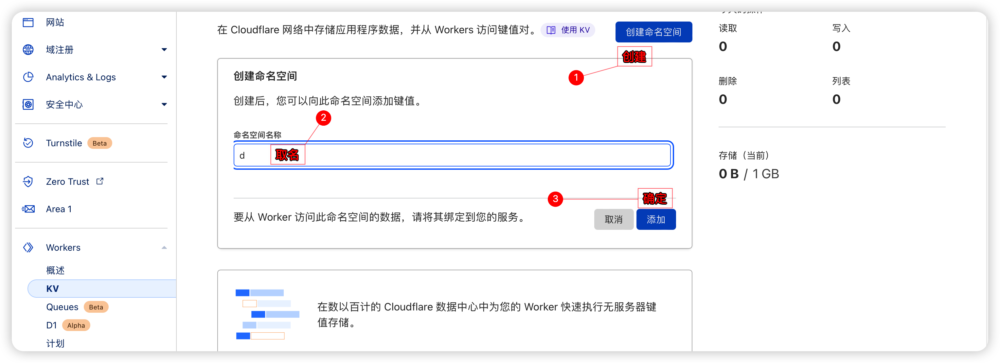
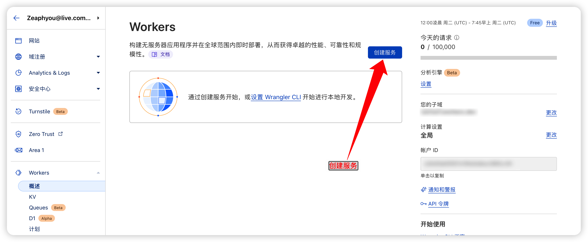
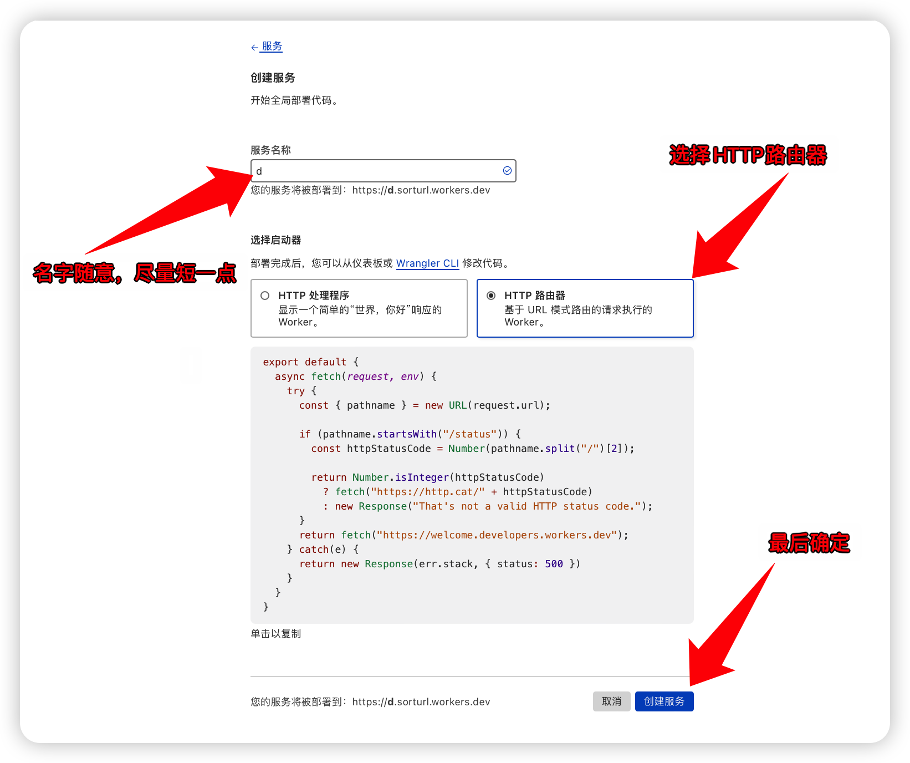
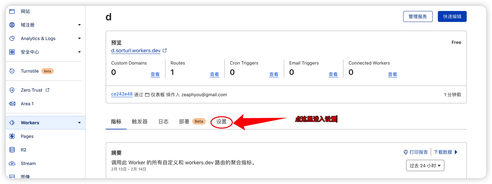
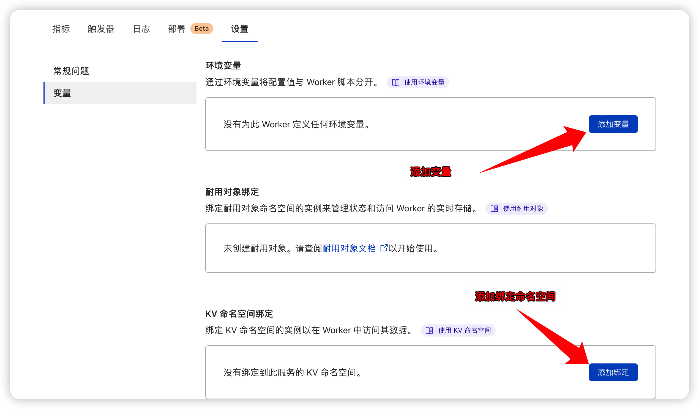
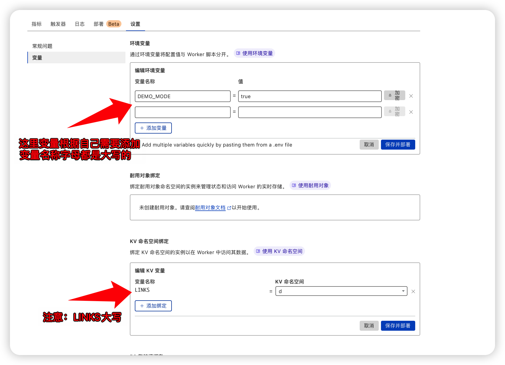
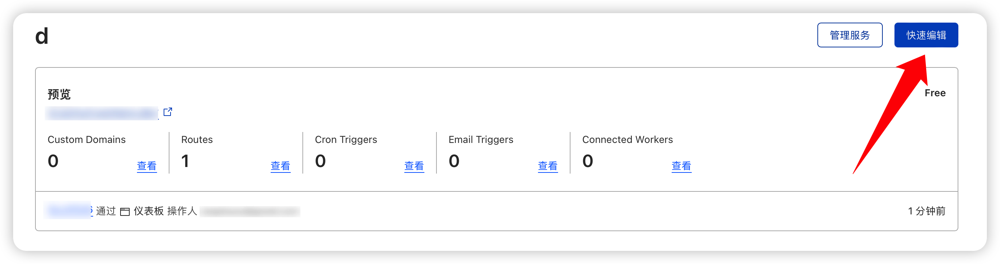
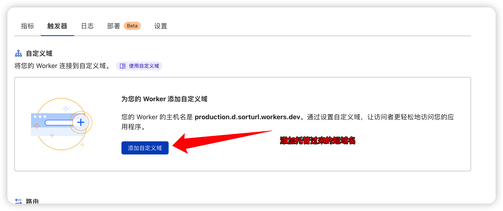

# 用Cloudflare worker自建短链接服务
题外话：CloudFlare的毛都快被薅秃了吧！
我的短链接服务网址：
https://getcats.tk 


https://choc.gq


## **短链接**
短链接又称短网址、短码，意思就是形式上比较短的网址。短链接服务，可以通过将一个普通的冗长的网址缩短生成一个新的较短的网址，便于分享传播。

短链接主要应用场景如下：

* 短信发送
短信里用短链接，可以极大减少字符，现在很多营销短信都是用的短网址。

* 社群推广
很多社区或社交网站，会屏蔽长链接。微博字数限制，公众号关键字链接限制等，短网址可以缩短字符，规避掉这些限制。

* 微信防屏蔽
微信里有各种屏蔽，用短链接可以避免暴露原有地址关键字，规避屏蔽。

* 活码
短网址是固定的，可以通过修改原链接达到变更地址的作用，此时不用去修改固定的短网址，短网址就相当于一个中间层。主要用于替换更换链接成本较高的地方，比如生成好的二维码等。

PS：短链接服务一定要用大厂，一般不至于跑路，稳定性有所保证。
GitHub，你看看你？git.io等我想用时候就跑路了！

## **自建短链接平台**

这里利用cloudflare workers提供的服务，免费版本每日100000次请求，对个人使用而言完全足够。

脚本配置基于GitHub开源项目[AoEiuV020/Url-Shorten-Worker](https://github.com/AoEiuV020/Url-Shorten-Worker)
这里说明一下：我自己搭建过程中其实是参考：https://github.com/xyTom/Url-Shorten-Worker 

**你需要准备的：**
* 一个cloudflare帐号
* 一个自己的域名，越短越好，并托管到cloudflare

**实施步骤：**
1，登陆你的cloudflare帐号，在Workers KV中创建一个命名空间，名称随意（尽量短）

2，Workers创建新服务

3，服务名称随意，启动器选择http路由器。

4，进入Workers服务，设置=》变量=》KV命名空间绑定，变量名称大写LINKS，值就是那个命名空间名；环境变量里再添加系列变量。变量说明如下：
***调整超时设置***
演示模式生成的短链接超时无法访问，
白名单或者密码正确情况超时设置无效，
修改脚本开头的变量SHORTEN_TIMEOUT, 单位毫秒，0表示不设置超时

***调整白名单*** 白名单中的域名设置短链接无视超时，
修改脚本开头的变量WHITE_LIST, 是个json数组，写顶级域名就可以，自动通过顶级域名和所有二级域名

***关闭演示模式***只有演示模式开启才允许访客无密码添加非白名单地址，超时短链接会失效，
修改脚本开头的变量DEMO_MODE，为true开启演示，为false无密码且非白名单请求不受理

***自动删除演示记录*** 针对演示模式开启情况下的超时失效的短链接记录是否自动删除，
修改脚本开头的变量REMOVE_COMPLETELY，为true自动删除超时的演示短链接记录，否则仅是标记过期，以便在后台查询历史记录

***修改密码*** 网页有个隐藏输入框可以输入密码，
密码正确情况无视白名单和超时设置，且支持自定义短链接，
修改脚本开头的变量PASSWORD，这个私密信息比较建议直接在环境变量里配置

***修改短链长度*** 短链长度就是随机生成的key也就是短链接的path部分的长度，
长度不够时容易出现重复，遇到重复时会自动延长，
修改脚本开头的变量DEFAULT_LEN

**注意：key均为对应大写**



5,回到【资源】，快速编辑，复制项目中的index.js的代码，即以下代码内容，保存并编译。



```
//index.js源代码


// 项目名，决定html从哪个项目获取，
const github_repo = typeof(GITHUB_REPO)!="undefined" ? GITHUB_REPO
    : 'charlie-king/Url-Shorten-Worker'
// 项目版本，cdn会有缓存，所以有更新时需要指定版本，
const github_version = typeof(GITHUB_VERSION)!="undefined" ? GITHUB_VERSION
    : '@main'
// 密码，密码正确情况无视白名单和超时设置，且支持自定义短链接，
const password = typeof(PASSWORD)!="undefined" ? PASSWORD
    : 'AoEiuV020 yes'
// 短链超时，单位毫秒，支持整数乘法，0表示不设置超时，
const shorten_timeout = typeof(SHORTEN_TIMEOUT)!="undefined" ? SHORTEN_TIMEOUT.split("*").reduce((a,b)=>parseInt(a)*parseInt(b),1)
    : (1000 * 60 * 10)
// 默认短链key的长度，遇到重复时会自动延长，
const default_len = typeof(DEFAULT_LEN)!="undefined" ? parseInt(DEFAULT_LEN)
    : 6
// 为true开启演示，否则无密码且非白名单请求不受理，是则允许访客试用，超时后失效，
const demo_mode = typeof(DEMO_MODE)!="undefined" ? DEMO_MODE === 'true'
    : true
// 为true自动删除超时的演示短链接记录，否则仅是标记过期，以便在后台查询历史记录，
const remove_completely = typeof(REMOVE_COMPLETELY)!="undefined" ? REMOVE_COMPLETELY === 'true'
    : true
// 白名单中的域名无视超时，json数组格式，写顶级域名就可以，自动通过顶级域名和所有二级域名，
const white_list = JSON.parse(typeof(WHITE_LIST)!="undefined" ? WHITE_LIST
    : `[
"aoeiuv020.com",
"aoeiuv020.cn",
"aoeiuv020.cc",
"020.name"
    ]`)
// 演示模式开启时网页上展示这段禁止滥用提示，并不需要明确表示什么时候失效，
const demo_notice = typeof(DEMO_NOTICE)!="undefined" ? DEMO_NOTICE
    : `注意：为防止示例服务被人滥用，故所有由demo网站生成的链接随时可能失效，如需长期使用请自行搭建。`
//console.log(`${github_repo}, ${github_version}, ${password}, ${shorten_timeout}, ${demo_mode}, ${white_list}, ${demo_notice}`)
const html404 = `<!DOCTYPE html>
<body>
  <h1>404 Not Found.</h1>
  <p>The url you visit is not found.</p>
</body>`
async function randomString(len) {
    let $chars = 'ABCDEFGHJKMNPQRSTWXYZabcdefhijkmnprstwxyz2345678';    /****默认去掉了容易混淆的字符oOLl,9gq,Vv,Uu,I1****/
    let maxPos = $chars.length;
  let result = '';
  for (i = 0; i < len; i++) {
    result += $chars.charAt(Math.floor(Math.random() * maxPos));
  }
  return result;
}
async function checkURL(url){
    let str=url;
    let Expression=/^http(s)?:\/\/(.*@)?([\w-]+\.)*[\w-]+([_\-.,~!*:#()\w\/?%&=]*)?$/;
    let objExp=new RegExp(Expression);
    if(objExp.test(str)==true){
      if (str[0] == 'h')
        return true;
      else
        return false;
    }else{
        return false;
    }
}

// 检查域名是否在白名单中，参数只包含域名部分，
async function checkWhite(host){
    return white_list.some((h) => host == h || host.endsWith('.'+h))
}
async function md5(message) {
  const msgUint8 = new TextEncoder().encode(message) // encode as (utf-8) Uint8Array
  const hashBuffer = await crypto.subtle.digest('MD5', msgUint8) // hash the message
  const hashArray = Array.from(new Uint8Array(hashBuffer)) // convert buffer to byte array
  const hashHex = hashArray.map(b => b.toString(16).padStart(2, '0')).join('') // convert bytes to hex string
  return hashHex
}
async function checkHash(url, hash) {
    if (!hash) {
        return false
    }
    return (await md5(url+password)) == hash
}
async function save_url(url, key, admin, len) {
  len = len || default_len;
    // 密码正确且指定了key的情况直接覆盖旧值，
    const override = admin && key
    if (!override) {
        // 密码不正确情况无视指定key,
        key = await randomString(len)
    }
    const is_exists = await load_url(key)
    console.log("key exists " + key + " " + is_exists)
    if (override || !is_exists) {
        var mode = 3
        if (admin) {
            mode = 0
        }
       let value = `${mode};${Date.now()};${url}`
        if (remove_completely && mode != 0 && !await checkWhite(new URL(url).host)) {
          // 利用expirationTtl实现过期记录自动删除，低于60秒会报错，
          let ttl = Math.max(60, shorten_timeout / 1000)
          console.log("key auto remove: " + key + ", " + ttl + "s")
          return await LINKS.put(key, value, {expirationTtl: ttl}),key
        } else {
          return await LINKS.put(key, value),key
        }
    } else {
        return await save_url(url, key, admin, len + 1)
    }
}
async function load_url(key) {
    const value = await LINKS.get(key)
    if (!value) {
        return null
    }
    const list = value.split(';')
    console.log("value split " + list)
    var url
    if (list.length == 1) {
        // 老数据暂且正常跳转，
        url = list[0]
    } else {
        url = list[2]
        const mode = parseInt(list[0])
        const create_time = parseInt(list[1])
        if (mode != 0 && shorten_timeout > 0
            && Date.now() - create_time > shorten_timeout) {
            const host = new URL(url).host
            if (await checkWhite(host)) {
              console.log('white list')
            } else {
                // 超时和找不到做同样的处理，
                console.log("shorten timeout")
                return null
            }
        }
    }
    return url
}
async function handleRequest(request) {
  console.log(request)
  if (request.method === "POST") {
    let req=await request.json()
    console.log("url " + req["url"])
    let admin = await checkHash(req["url"], req["hash"])
    console.log("admin " + admin)
    if(!await checkURL(req["url"]) || (!admin && !demo_mode && !await checkWhite(new URL(req["url"]).host))){
    // 非演示模式下，非白名单地址当成地址不合法处理，
    return new Response(`{"status":500,"key":": Error: Url illegal."}`, {
      headers: {
      "content-type": "text/html;charset=UTF-8",
      "Access-Control-Allow-Origin":"*",
      "Access-Control-Allow-Methods": "POST",
      },
    })}
    let stat,random_key=await save_url(req["url"], req["key"], admin)
    console.log("stat " + stat)
    if (typeof(stat) == "undefined"){
      return new Response(`{"status":200,"key":"/`+random_key+`"}`, {
      headers: {
      "content-type": "text/html;charset=UTF-8",
      "Access-Control-Allow-Origin":"*",
      "Access-Control-Allow-Methods": "POST",
      },
    })
    }else{
      return new Response(`{"status":200,"key":": Error:Reach the KV write limitation."}`, {
      headers: {
      "content-type": "text/html;charset=UTF-8",
      "Access-Control-Allow-Origin":"*",
      "Access-Control-Allow-Methods": "POST",
      },
    })}
  }else if(request.method === "OPTIONS"){  
      return new Response(``, {
      headers: {
      "content-type": "text/html;charset=UTF-8",
      "Access-Control-Allow-Origin":"*",
      "Access-Control-Allow-Methods": "POST",
      },
    })
  }
  const requestURL = new URL(request.url)
  const path = requestURL.pathname.split("/")[1]
  console.log(path)
  if(!path){
    const html= await fetch(`https://cdn.jsdelivr.net/gh/${github_repo}${github_version}/index.html`)
    const text = (await html.text())
        .replaceAll("###GITHUB_REPO###", github_repo)
        .replaceAll("###GITHUB_VERSION###", github_version)
        .replaceAll("###DEMO_NOTICE###", demo_notice)
    return new Response(text, {
    headers: {
      "content-type": "text/html;charset=UTF-8",
    },
  })
  }
  const url = await load_url(path)
  if (!url) {
    // 找不到或者超时直接404,
    console.log('not found')
    return new Response(html404, {
      headers: {
        "content-type": "text/html;charset=UTF-8",
      },
      status: 404
    })
  }
  return Response.redirect(url, 302)
}
addEventListener("fetch", async event => {
  event.respondWith(handleRequest(event.request))
})

```

6,最后一步，添加自定义域名，域名需先托管到cloudflare解析，此时你就可以通过这个域名访问并生成短链接了。



