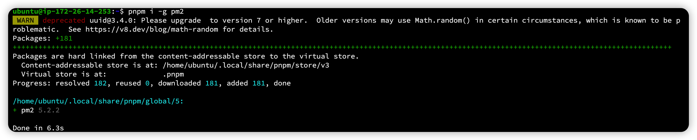
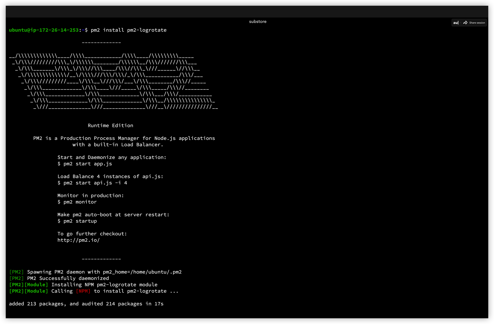
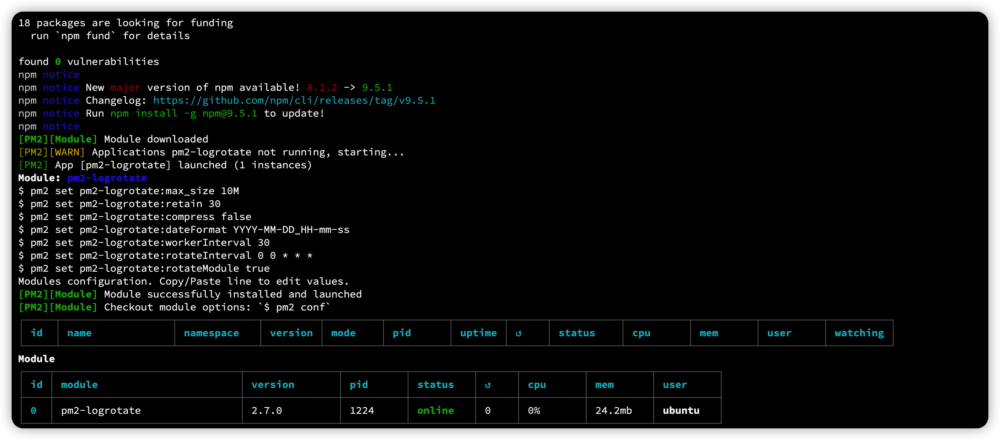
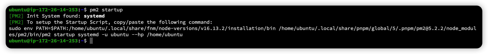
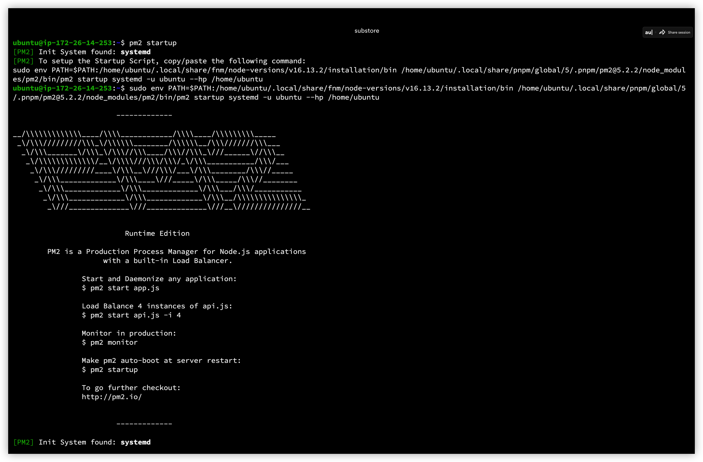
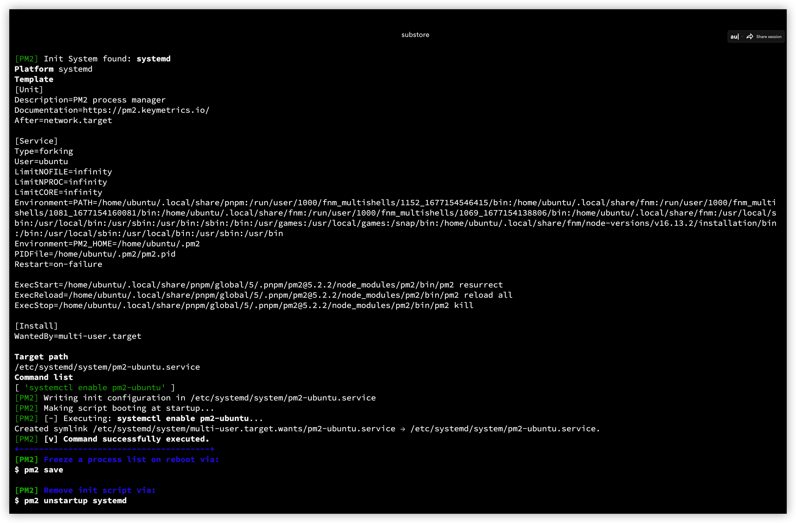
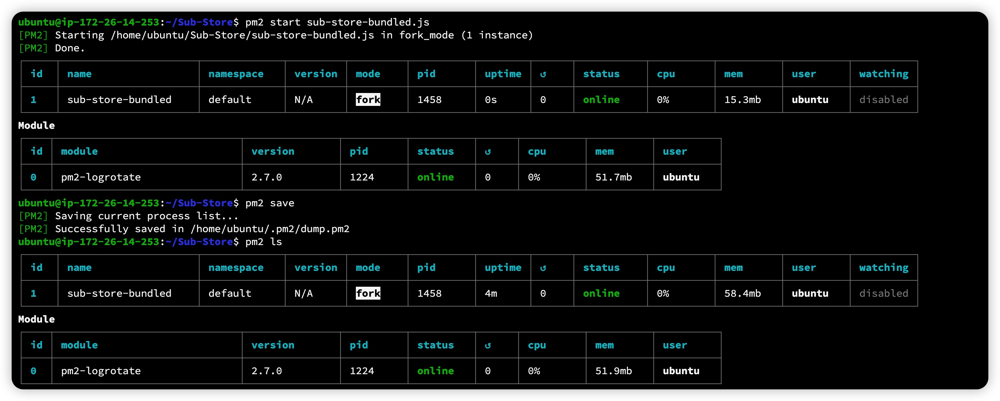
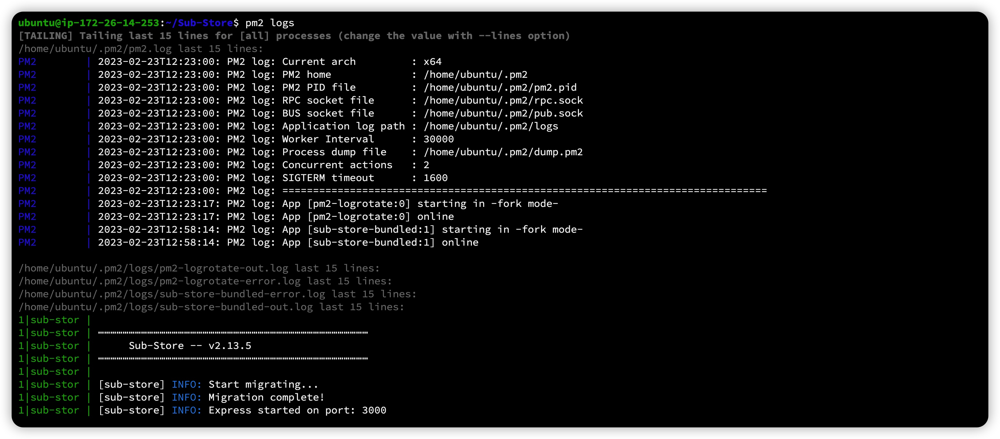

# 用VPS架设自己的Sub-store

**写在前面：十分感谢 小一@xream 大佬帮忙在我VPS上亲自进行了一次部署，并且留下步骤说明！**

## 你需要的：
* 一台VPS，配置高点，不要太低。（一开始我开的甲骨文的1C1G的永远免费实例，小一大佬说编译过程中卡死失联了，后面查了下IP也被墙了，然后改成ARM的2+12上部署就很顺利）
* 一个域名，托管到cloudflare（其它地方也行，但是CF相对比较方便）
* 写本教程截图的是我后面重新开的 AWS lightsail（10刀/月，1C2G的配置三个月试用）上进行的，系统是ubuntu，并且一边按照大佬留下的命令步骤来进行部署，一边截图。

## 部署过程

### 1，域名设置

在cloudflare的域名DNS记录里面添加两个A记录，一个是`substore.domain.com`,一个是`subapi.domain.com` (实际A记录的名字随意，只要你能区分就行）
见下图例子：

备注：后面的代理黄云勾不勾随意，如果你用其它第三方ssl证书可以不勾，如果用CF的证书就勾上。

### 2，脚本的前端后端安装过程

#### 1，ssh登陆到vps后，对vps进行常规升级和更新：

Tip：我是在新开的主机上进行部署，所以有更新和安装过程，如果你上面已经安装有相关的可以跳过

```
sudo apt update -y 
```

#### 2，安装 `unzip wget git` 

```
sudo apt install unzip wget git -y
```
#### 3，下载和安装 fnm （Node.js版本管理器）

```
curl -fsSL https://fnm.vercel.app/install | bash

```

> **看上一步的提示复制粘贴 不要抄下面的**

#### 4，根据上一步提示执行命令：

```
source /home/ubuntu/.bashrc
```

#### 5，安装node.js

```
fnm install v16.13.2
```
#### 6，安装 PNPM 软件包管理器

```
curl -fsSL https://get.pnpm.io/install.sh | sh -
```


#### 7，根据上一步提示执行命令
> **看上一步的提示复制粘贴 不要抄下面的**

```
source /home/ubuntu/.bashrc
```
#### 8，全局安装pm2

```
pnpm i -g pm2
```


#### 9，安装pm2 log自动清理插件

```
pm2 install pm2-logrotate
```




> pm2-logrotate是PM2（Process Manager 2）的一个插件，它允许对PM2进程的日志进行自动轮转和清理，以防止日志文件变得过大而导致磁盘空间耗尽。

> pm2-logrotate插件可以通过pm2命令行工具来安装，使用以下命令：

> pm2 install pm2-logrotate


> 安装完成后，pm2-logrotate将自动在PM2的配置文件中添加一个新的配置块，其中包含了轮转日志的设置，如日志文件的最大大小、要保留的日志文件数等。

> 此外，pm2-logrotate还提供了一些其他的功能，例如日志的压缩和备份等，可以通过配置文件进行自定义配置。
> 以上由chatgpt解释


#### 10，运行pm2，并按照相应的指令进行下一步


```
pm2 startup

```


> pm2 startup 是一个命令行工具，可以让 PM2 在系统启动时自动运行。当您在服务器上部署 Node.js 应用程序时，您通常希望应用程序在服务器重启后自动启动。使用 pm2 startup 命令，您可以配置系统服务，以便在启动时启动 PM2，并自动启动您先前使用 PM2 启动的所有应用程序。

> pm2 startup 命令将生成一个启动脚本，并向您的操作系统注册它。该脚本将在系统启动时运行，并启动您之前使用 PM2 启动的所有应用程序。在执行 pm2 startup 命令后，您需要按照命令行中的指示运行生成的脚本，以确保它已正确安装并设置了启动服务。这样，无论何时重启服务器，您的 Node.js 应用程序都将自动启动。
> 由chatgpt解答

#### 11，执行上一步命令生成的命令：
 > **看上一步的提示复制粘贴 不要抄下面的**

```
sudo env PATH=$PATH:/home/ubuntu/.local/share/fnm/node-versions/v16.13.2/installation/bin /home/ubuntu/.local/share/pnpm/global/5/.pnpm/pm2@5.2.2/node_modules/pm2/bin/pm2 startup systemd -u ubuntu --hp /home/ubuntu
```



#### 12，创建Sub-store的安装文件夹并进入该文件夹

```
mkdir -p ~/Sub-Store

cd ~/Sub-Store

```
#### 13，下载前端页面压缩包并解压缩

```
wget https://github.com/xream/Sub-Store/releases/download/2.13.5-alpha/dist.zip -O frontend.zip

```
```
unzip frontend.zip

```


#### 14，将disk文件夹复制到相应目录，后面前端页面要用到

```
sudo cp -R dist /var/www/html/

```

> **注意：有些VPS如果直接执行上面操作会提示没有那个文件或者文件夹
> 解决办法是如上图所示切换到相应的目录去建立对应的文件夹然后再执行复制操作。**

#### 15，下载后端sub-store脚本

```
wget https://github.com/xream/Sub-Store/releases/download/2.13.5-alpha/sub-store.js -O sub-store-bundled.js
```


#### 16，运行sub-store脚本

```
pm2 start sub-store-bundled.js
```


#### 17，保存脚本运行进程

```
pm2 save
```


> pm2 save 是 PM2 进程管理器的一个命令，用于将当前所有正在运行的进程信息保存到一个文件中，以便在下次启动时自动加载。

#### 18，列出当前脚本运行状态

```
pm2 ls
```



> pm2 ls 是一个命令行命令，用于列出当前正在使用 PM2 进程管理器管理的所有应用程序。

> 具体来说，它会显示一个表格，其中包含每个应用程序的 ID、名称、状态、CPU 和内存使用情况、启动时间等信息。如果应用程序正在运行，它将显示 "online" 状态，否则将显示 "offline" 状态。
> 由chatgpt解答

#### 19，查看脚本实时运行日志，看是否有问题

```
pm2 logs
```


> pm2 logs 命令将在终端上打印出所有进程的实时日志。可以使用该命令来查看应用程序的日志，以便及时发现和解决问题。 

> Tips：按 CTRL+C 退出logs界面

### 3，安装设置nginx

#### 1，安装nginx

```
sudo apt install nginx -y
```
#### 2，编辑nginx配置

```
sudo vim /etc/nginx/sites-enabled/sub-store.conf
```

根据自己的前面域名设置将以下内容改好后复制进去并保存


```
server {
  server_name subapi.domaim.com;            //改成你自己的api域名
  listen        80;
  location /eWVOSn8esAtDJLgTWBIi4VKL/{      //API-token也要根据需要修改，尽量复杂
    proxy_pass http://127.0.0.1:3000/;
  }
}
server {
  listen 80;
  listen [::]:80;
  root /var/www/html/dist;
  index index.html index.htm;
  server_name substore.domain.com;        ////改成你自己的sub域名
  location / {
    try_files $uri $uri/ /index.html;
  }
}

```


#### 3,检查一下nginx的配置是否正确

```
sudo nginx -t
```


#### 4，重载nginx配置，使更改的配置生效

```
sudo nginx -s reload
```
#### 5，将端口放行

```
sudo iptables -P INPUT ACCEPT
sudo iptables -P FORWARD ACCEPT
sudo iptables -P OUTPUT ACCEPT
sudo iptables -F
sudo netfilter-persistent save
```
> tips：上述操作Oracle的VPS需要进行，可能一些不需要，自己根据情况进行使用
> nginx的配置文件没有进行ssl证书设置，请自行搜索教程添加（小一大佬也没加我也不懂


至此整个安装部署过程就已经结束了，访问你的sub-store的地址是：

```
http://substore.domain.com/?api=http://subapi.domain.com/api-token
```

如果没有出错的话：


再次感谢小一大佬 @xread 热心帮助！