# 通过s3协议，把Oracle存储桶当图床用

## 前言：

本文主要内容来源于这篇： [https://blog.dominoh.com/ac0b3131.html]( https://blog.dominoh.com/ac0b3131.html) ，是我在遇到问题时候搜到的这篇文章，也正好解决了我的问题，在此对作者表示感谢！

大家也知道，我在去年的时候开始折腾surge相关的一些东西，从开始使用机场到后面开始尝试自建，从中间踩过AWS的一些坑，到后面托一些朋友的福，以比较好的价格买到了一个首尔甲骨文账号，再加上后面[本群](https://t.me/+xPEp7i13b1FjNjk0)的一位很够意思的朋友送了两个升级号给我，虽然目前都没什么大的好的用途，就是挂了几个telegram的bot以及做了几个节点分享给群里的小伙伴使用，然后平时写的一些东西也是在GitHub里面，因为教程写的比较多，而且又是比较低级的教程，就涉及到一个截图的处理，尤其是图床问题。

虽然GitHub也可以上传图片，但是使用起来还是相当不方便，我平时在本机写的时候都是用Typroa，Typroa我就不再做过多的介绍了，它自带的是新浪的图床，但是好像只有一年的保存期，它的一个优点就是强大的扩展性，可以通过第三方iPic、uPic、Picsee、PicGo-Core (command line)、PicGo.app来进行图床服务，在经过自己的试用和摸索后，结合网上教程，最终选定PicGo.app利用S3协议配置结合甲骨文的免费存储桶来使用图床服务。

## 一，创建存储桶

要使用存储桶当然首先得去创建一个存储桶，并且注意记录下后面提到的一些相关信息。

1，进入甲骨文的控制台，点击左上角的存储–存储桶

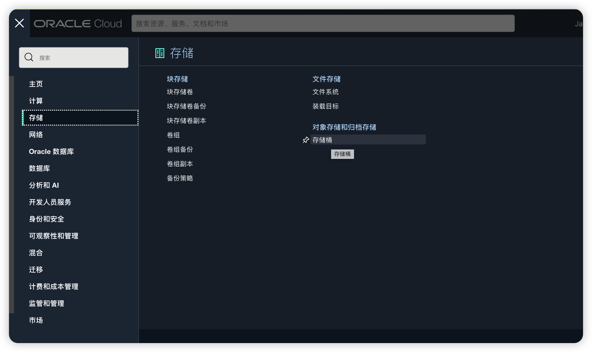

2，点进去存储桶后，点击创建存储桶，然后给存储桶取一个名字（英文+数字），并且要记住，因为后面要用到的。目前Oracle给的存储桶的免费空间是20G，做图床是完全足够使用的。

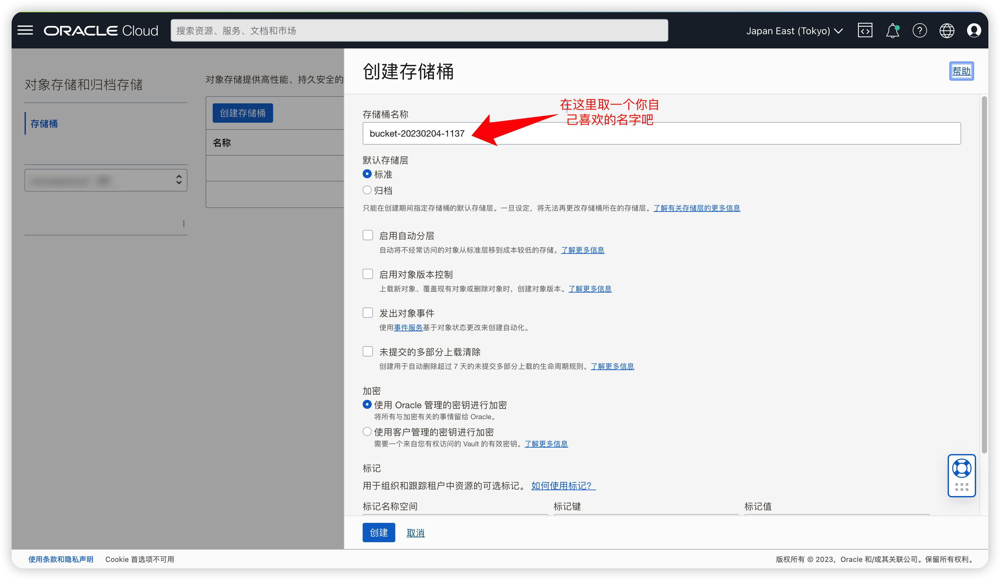

3，创建好存储桶后，点击一下存储桶名称，进去后可以看到存储桶的一些详细信息，按照下图箭头指示的地方，将名称空间后面的字符串（namespace）记录下来

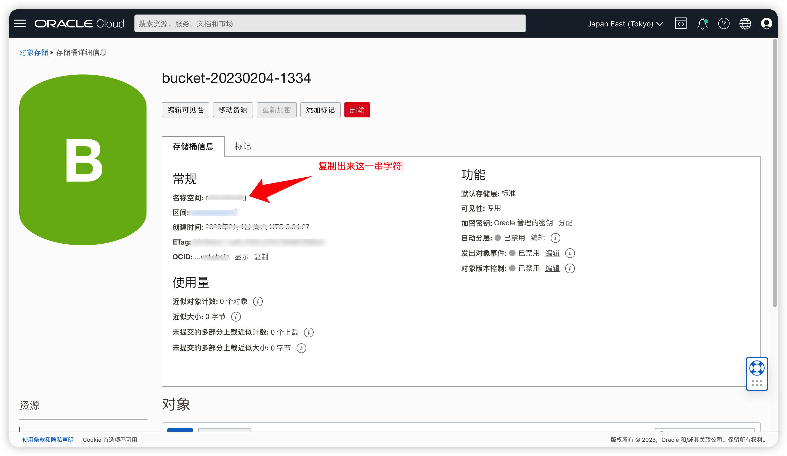

4，点击一下右上角的用户图标，点击租户名，进入租户详情页

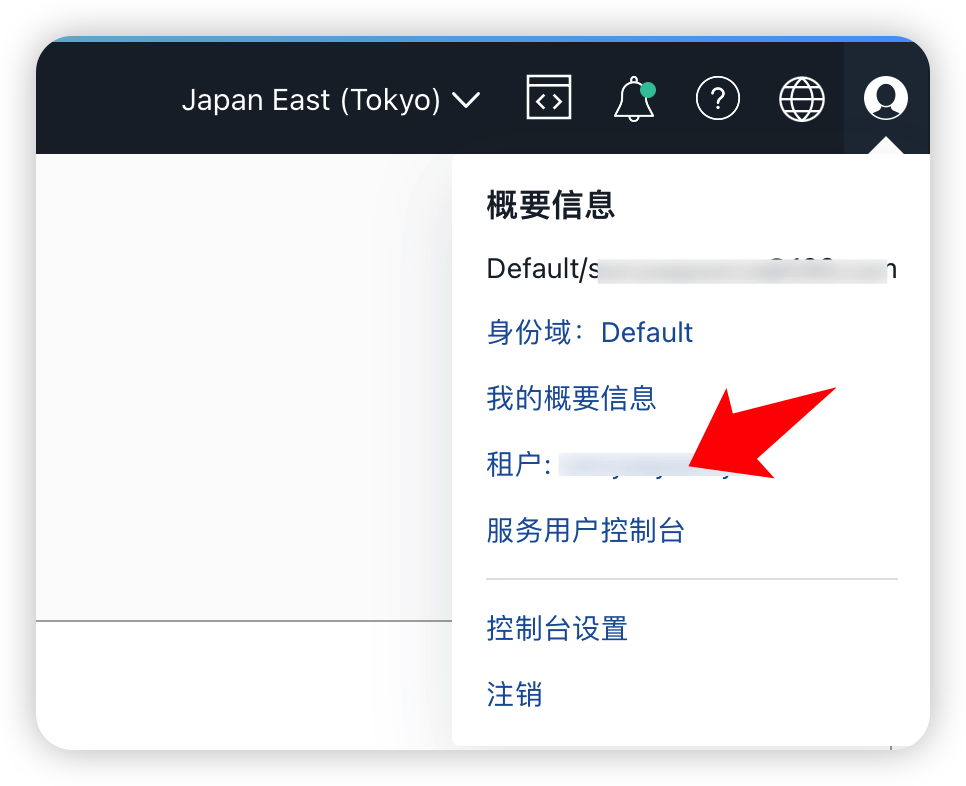

5，在租户详情页，对象存储设置底下，对象存储名称空间页可以看到第三步里面提到的namespace，在浏览器的地址栏里面，region=ap-tokyo-1，里面的ap-tokyo-1既是region名称，也把它记下来，如果你是别的区域的Oracle可能此处会不一样，记下相应的字符串就好了。

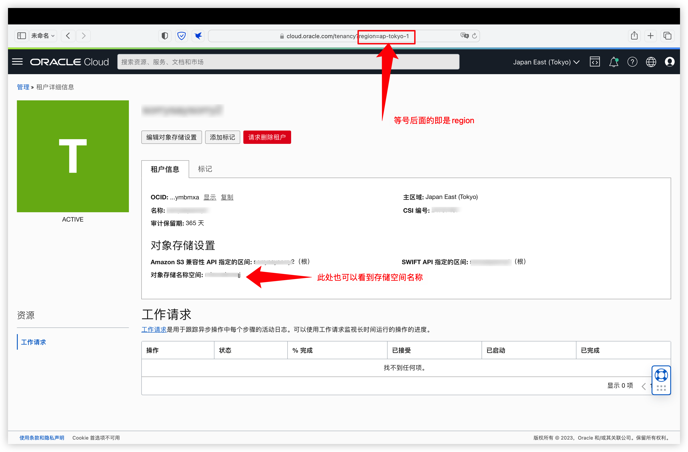

6，点击右上角的用户图标，选择我的概要信息

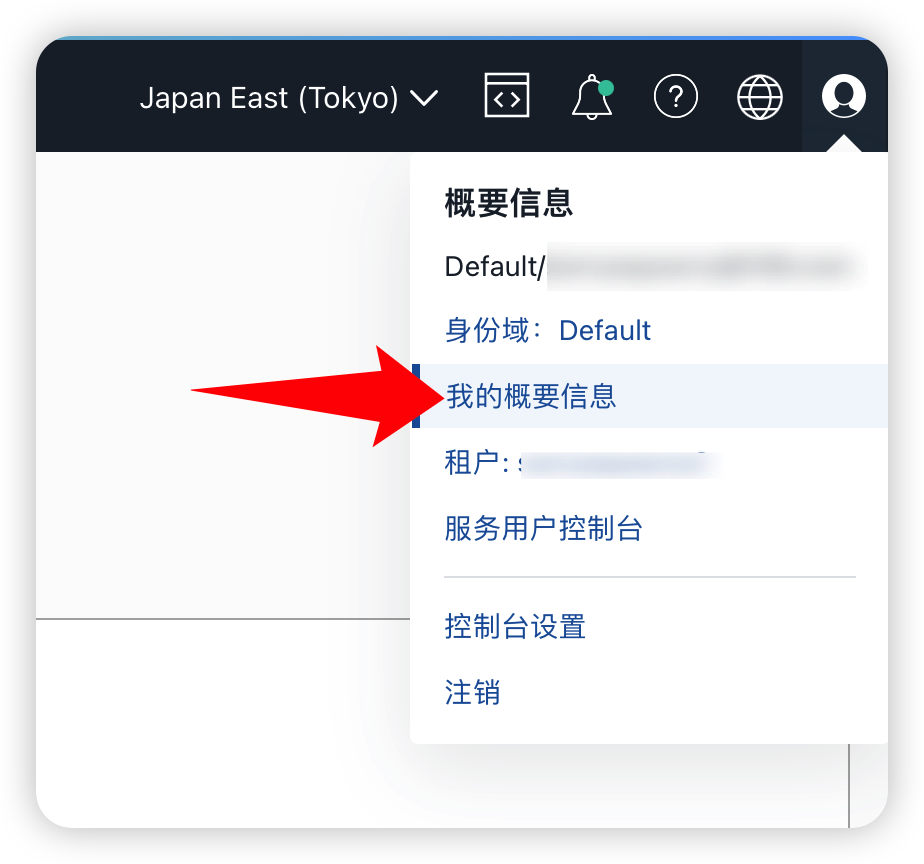

7，进入我的概要信息后，在左侧找到**资源`-`客户密钥**，英文下是**Customer secret keys**，点击后进入到客户密钥界面。

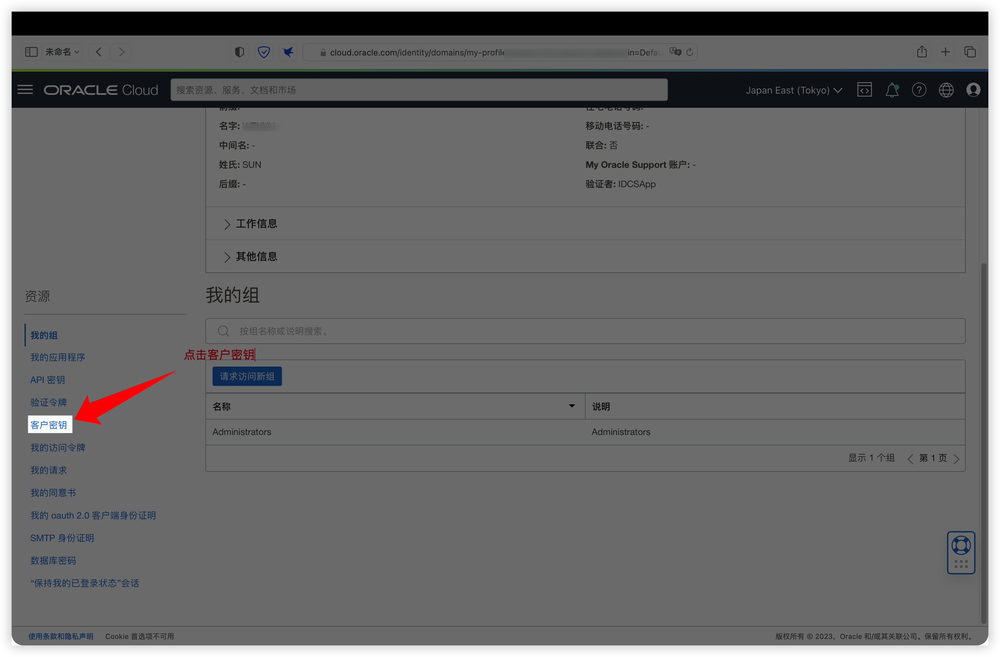

8，点击生成密钥，按照要求取一个名字，然后点击生成密钥，来生成一个密钥

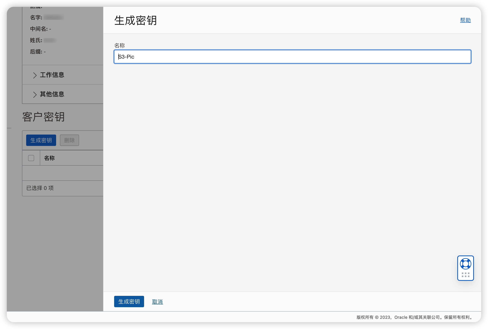

9，复制并记录好生成的密钥，**切记一定要保存好，因为只显示一次。**

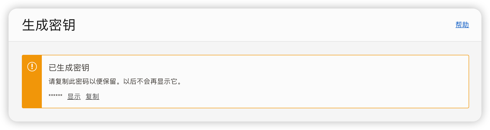

10，我们就能在列表里看到刚才生成的密钥了。

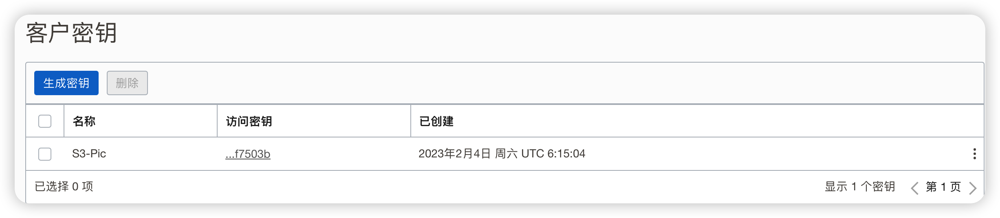

在访问密钥那里，将鼠标移到字符串会显示访问密钥的完整内容，将它也复制出来后面要用到。

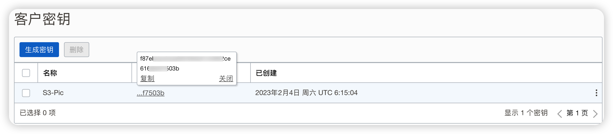

至此在Oracle这边的设置就是已经完成了，接下来就是PicGo的安装和设置了。

## 二，PicGo安装和设置

1，PicGo安装

PicGo的GitHub地址：https://github.com/Molunerfinn/PicGo

里面有详细的文档，具体安装过程我就不再赘述了。

2，PicGo的设置

2.1 下载安装好后，在**插件设置**中搜索**s3**并安装**s3协议插件**。

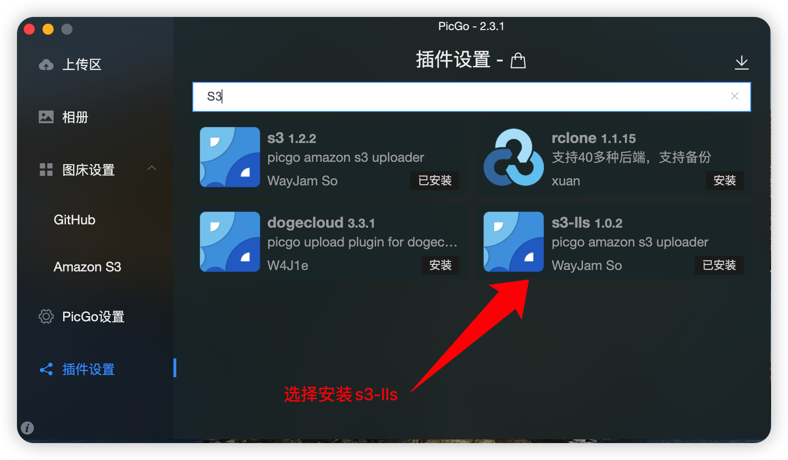

2.2 安装完后点击**图床设置-AmazonS3**，我们会看到很多很多需要填写的东西

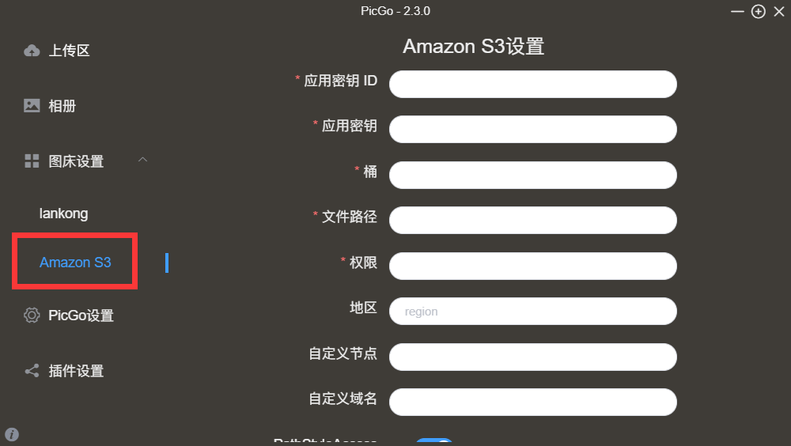

2.3 首先看应用密钥ID和密钥，密钥ID是刚才最后一步在列表中看到的那一串字符；密钥是倒数第二步中只显示一次的那一串字符。把它们俩分别拷贝进输入框中。

2.4 然后是桶，这里填甲骨文对象存储桶的名字，也就是第2步中创建的名称。如果忘记的话，可以在左上角存储-存储桶中的列表里找到。

2.5 接下来是文件路径，这里的参数决定了你的图片会被上传到什么目录下。有一些变量可以用，比如想存到年/月目录下并以md5命名的话，就可以填写{year}/{month}/{md5}.{extName}，最后一个参数是扩展名，这里抛砖引玉，各位按需填写。

2.6 权限填public-read就可以了，公开可读

2.7 地区这里就是填之前的region参数，例如我的是：ap-tokyo-1（备注，截图是之前在首尔的甲骨文做的，所以里面的region是ap-seoul-1，反正根据之前租户详情页上面的来。

2.8 自定义节点，这里填得麻烦一点点

`https://[namespace].compat.objectstorage.[region].oraclecloud.com/`

注意⚠️：这里括号里面的**namespace和region必须替换成你自己的**，就是在创建存储桶里面要求记下来的名称空间后面的字符串和上面region后面字符串，替换好后再粘贴进去。

2.9 自定义域名，这里同样需要有需要替换的部分。**region**和**namespace**和上面一样，**bucketname**是桶名，第1步里那一个

`https://objectstorage.[region].oraclecloud.com/n/[namespace]/b/[bucketname]/o`

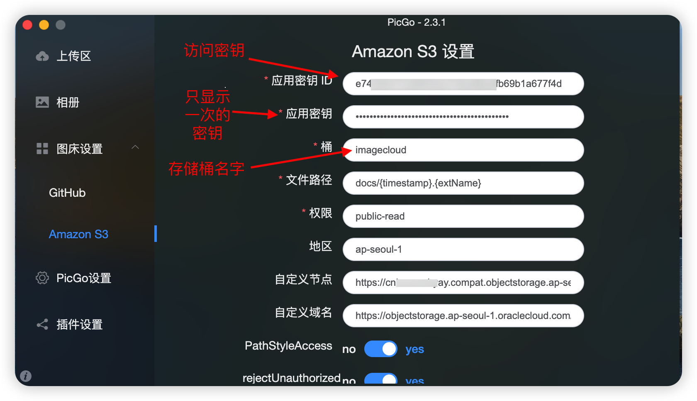

2.10 按照上面配置好后，可以回到上传区，拖一张图片进去测试一下看是否设置成功。

当图床设置好后，到Typroa里面图床直接选择PicGo测试一下成功的话就可以使用啦。
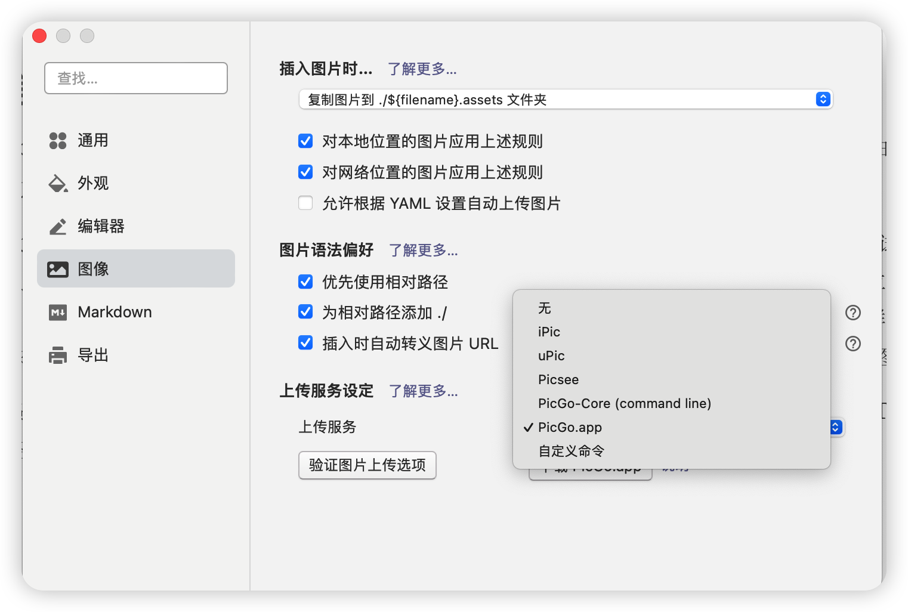

